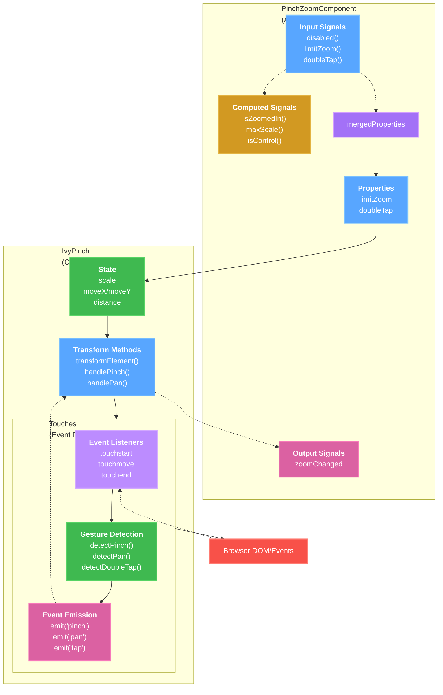
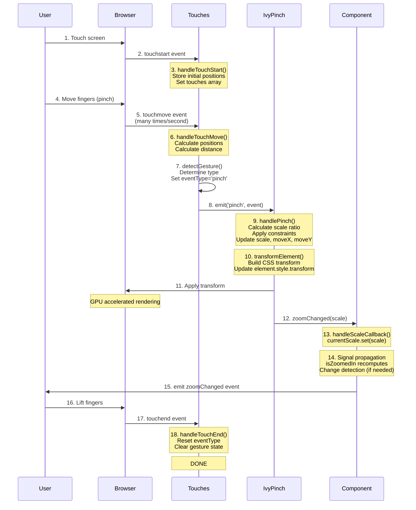
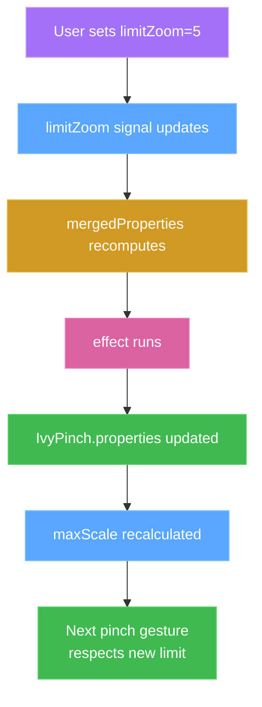
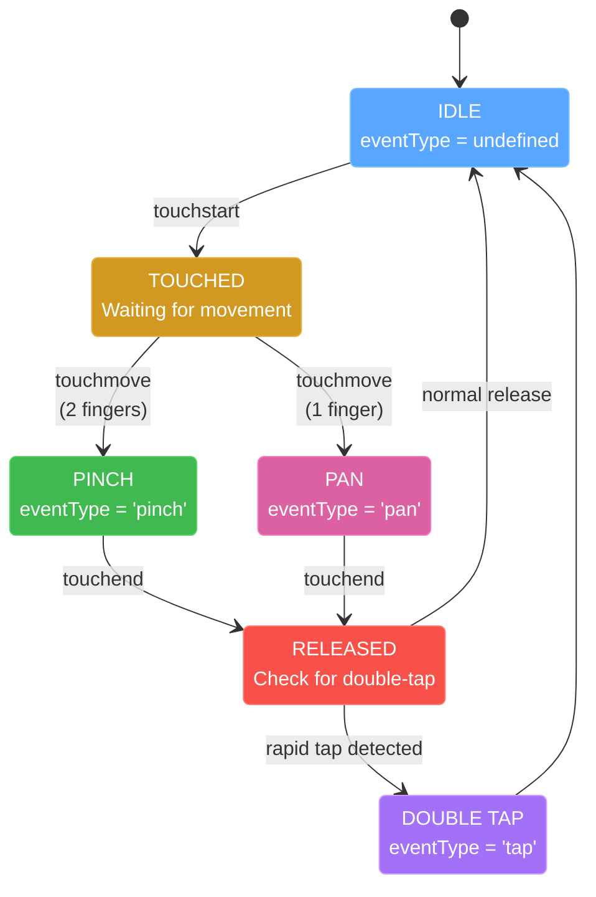
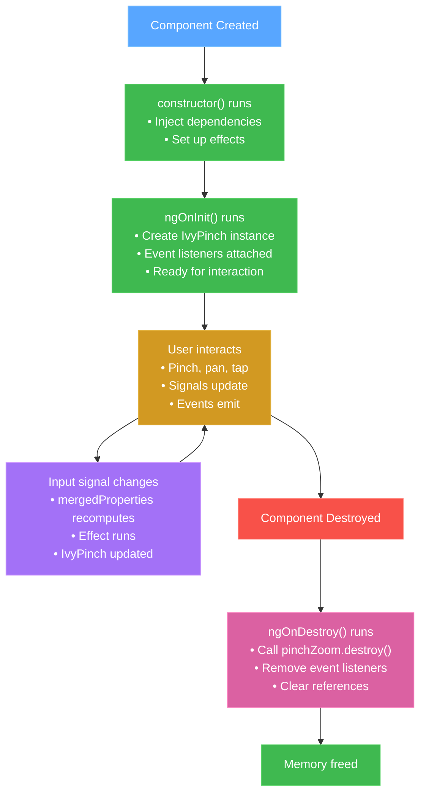
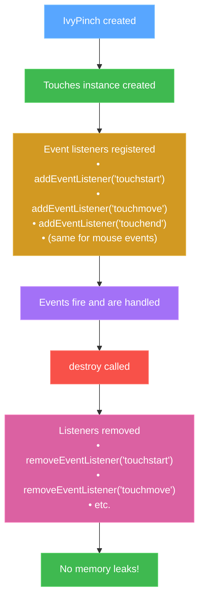

# Architecture Documentation

Deep dive into how ngx-pinch-zoom works internally. For quick lookups, see [QUICK_REFERENCE.md](QUICK_REFERENCE.md). For implementation examples, see [IMPLEMENTATION_GUIDE.md](IMPLEMENTATION_GUIDE.md).

## Table of Contents

- [Overview](#overview)
- [Component Architecture](#component-architecture)
- [Data Flow](#data-flow)
- [Signal Architecture](#signal-architecture)
- [Core Classes](#core-classes)
- [Event System](#event-system)
- [Transform Mathematics](#transform-mathematics)
- [Touch Gesture Detection](#touch-gesture-detection)
- [Constraint System](#constraint-system)
- [Lifecycle](#lifecycle)

## Overview

### High-Level Architecture



### Design Principles

1. **Separation of Concerns**
   - **PinchZoomComponent**: Angular integration, signals, lifecycle
   - **IvyPinch**: Pure business logic, no Angular dependencies
   - **Touches**: Pure event handling, no Angular dependencies

2. **Signal-Based Reactivity**
   - All inputs use Angular 20+ input signals
   - Computed signals for derived state
   - Output signals for events
   - Effects for side effects

3. **Framework Independence**
   - IvyPinch and Touches can work without Angular
   - Could be ported to React, Vue, or vanilla JS
   - DOM manipulation is isolated

4. **Performance First**
   - CSS transforms for hardware acceleration
   - `translate3d` forces GPU rendering
   - No layout thrashing (read/write separation)
   - Minimal change detection triggers

## Component Architecture

### PinchZoomComponent (Angular Layer)

**Responsibilities:**
- Provide Angular component interface
- Manage input/output signals
- Initialize and cleanup IvyPinch
- Bridge between Angular and core logic

**Key Features:**
```typescript
@Component({
    selector: 'pinch-zoom, [pinch-zoom]',
    standalone: true,  // No NgModule needed
    // ...
})
export class PinchZoomComponent {
    // INPUT SIGNALS (from user)
    disabled = input<boolean>(false);
    limitZoom = input<number>(3);

    // INTERNAL SIGNALS (state)
    private currentScale = signal<number>(1);

    // COMPUTED SIGNALS (derived)
    isZoomedIn = computed(() => this.scale() > 1);

    // OUTPUT SIGNALS (to user)
    zoomChanged = output<number>();

    // EFFECTS (side effects)
    constructor() {
        effect(() => {
            if (this.disabled()) {
                this.pinchZoom?.destroy();
            }
        });
    }
}
```

### IvyPinch (Core Logic Layer)

**Responsibilities:**
- Calculate zoom scale from pinch gestures
- Calculate pan position from swipe gestures
- Apply constraints (min/max zoom, pan limits)
- Update DOM with CSS transforms
- Notify component of changes

**Key State:**
```typescript
class IvyPinch {
    // Zoom state
    public scale: number = 1;           // Current scale (1 = 100%)
    private initialScale: number = 1;   // Scale at gesture start
    private maxScale: number = 3;       // Maximum allowed scale

    // Position state
    public moveX: number = 0;           // Horizontal offset (px)
    public moveY: number = 0;           // Vertical offset (px)
    private initialMoveX: number = 0;   // Position at gesture start
    private initialMoveY: number = 0;

    // Gesture state
    private distance: number = 0;       // Distance between fingers
    private initialDistance: number = 0; // Distance at pinch start
}
```

### Touches (Event Handling Layer)

**Responsibilities:**
- Listen to touch/mouse events
- Detect gesture types (pinch, pan, double-tap)
- Calculate touch positions and distances
- Emit typed events to IvyPinch

**Event Flow:**
```typescript
class Touches {
    // Event type state machine
    private eventType: 'pinch' | 'pan' | 'tap' | undefined;

    // Touch tracking
    private touches: Touch[] = [];

    // Event handlers
    private handlers = {
        pinch: [],
        pan: [],
        tap: []
    };

    // Core detection loop
    detectGesture() {
        this.detectDoubleTap() ||    // Check tap first
        this.detectPinch() ||         // Then pinch
        this.detectLinearSwipe();     // Finally pan
    }
}
```

## Data Flow

### Complete User Interaction Flow



### Signal Reactivity Flow



## Signal Architecture

### Why Signals?

Angular 20's signals provide:
1. **Fine-grained reactivity** - Only affected components update
2. **Automatic dependency tracking** - Computed signals track dependencies
3. **Better performance** - Less change detection overhead
4. **Simpler mental model** - Clear data flow

### Input Signals Pattern

```typescript
// OLD WAY (Angular <16)
@Input() disabled: boolean = false;

ngOnChanges(changes: SimpleChanges) {
    if (changes['disabled']) {
        // React to change
    }
}

// NEW WAY (Angular 20+)
disabled = input<boolean>(false);

constructor() {
    effect(() => {
        if (this.disabled()) {
            // Automatically runs when disabled changes
            this.pinchZoom?.destroy();
        }
    });
}
```

### Computed Signals Pattern

```typescript
// Automatically recalculates when dependencies change
isZoomedIn = computed<boolean>(() => {
    return this.scale() > 1;
    // ↑ Dependency tracked automatically
});

maxScale = computed<number>(() => {
    const limit = this.limitZoom();

    if (limit === 'original image size') {
        return this.calculateImageScale();
    }

    return limit;
});
```

### Output Signals Pattern

```typescript
// OLD WAY
@Output() zoomChanged = new EventEmitter<number>();
this.zoomChanged.emit(scale);

// NEW WAY
zoomChanged = output<number>();
this.zoomChanged.emit(scale);
```

### Signal Update Flow

```typescript
// Component receives scale update from IvyPinch
private handleScaleCallback = (scale: number) => {
    // 1. Update internal signal
    this.currentScale.set(scale);

    // 2. Computed signals automatically recalculate
    //    isZoomedIn() will update
    //    maxScale() will update (if dependencies changed)

    // 3. Template updates (if using signals in template)
    //    {{ scale() }} will show new value

    // 4. Emit to parent component
    this.zoomChanged.emit(scale);
};
```

## Core Classes

### PinchZoomComponent Deep Dive

#### mergedProperties Computed Signal

The most important computed signal merges all inputs:

```typescript
mergedProperties = computed<ComponentProperties>(() => {
    return {
        // Start with defaults
        ...this.defaultComponentProperties,

        // Override with user properties object
        ...this.properties(),

        // Override with individual input signals
        transitionDuration: this.transitionDuration(),
        doubleTap: this.doubleTap(),
        doubleTapScale: this.doubleTapScale(),
        limitZoom: this.limitZoom(),
        disabled: this.disabled(),
        disablePan: this.disablePan(),
        // ... all other inputs
    };
});
```

This ensures:
- Individual inputs take priority
- properties object can set multiple at once
- Defaults are always present
- Single source of truth

#### Initialization Flow

```typescript
ngOnInit(): void {
    // 1. Get merged configuration
    const properties = this.mergedProperties();

    // 2. Get DOM element
    const element = this.elementRef.nativeElement;

    // 3. Create IvyPinch instance
    this.pinchZoom = new IvyPinch(
        properties,
        this.handleScaleCallback  // Callback for updates
    );

    // 4. IvyPinch creates Touches instance
    // 5. Event listeners attached
    // 6. Ready for user interaction
}
```

#### Cleanup Flow

```typescript
ngOnDestroy(): void {
    this.pinchZoom?.destroy();
    // ↓
    // IvyPinch.destroy() called
    // ↓
    // Touches.destroy() called
    // ↓
    // Event listeners removed
    // ↓
    // References cleared
    // ↓
    // Memory freed
}
```

### IvyPinch Deep Dive

#### Transform Calculation (The Heart of the Library)

```typescript
private transformElement(scale: number, moveX: number, moveY: number) {
    // 1. Build transform string
    const transform = `
        translate3d(${moveX}px, ${moveY}px, 0)
        scale(${scale})
    `;

    // 2. Apply to element
    this.element.style.transform = transform;

    // Why translate3d instead of translateX/translateY?
    // - Forces GPU acceleration (3D rendering pipeline)
    // - Better performance on mobile devices
    // - Smoother animations

    // Why scale() after translate?
    // - Transform order matters!
    // - translate then scale = scale around new position
    // - scale then translate = translate scaled amount
}
```

#### Pinch Zoom Algorithm

```typescript
handlePinch(event: any) {
    // 1. Get current distance between fingers
    const currentDistance = this.touches.distance;

    // 2. Initialize if first pinch move
    if (this.distance === 0) {
        this.distance = currentDistance;
        this.initialDistance = currentDistance;
    }

    // 3. Calculate scale ratio
    //    If fingers move apart: ratio > 1 (zoom in)
    //    If fingers move together: ratio < 1 (zoom out)
    const scaleRatio = currentDistance / this.initialDistance;

    // 4. Apply ratio to initial scale
    let newScale = this.initialScale * scaleRatio;

    // 5. Apply constraints
    newScale = Math.max(this.minScale, newScale);
    newScale = Math.min(this.maxScale, newScale);

    // 6. Calculate zoom center (between fingers)
    const centerX = (touch1.clientX + touch2.clientX) / 2;
    const centerY = (touch1.clientY + touch2.clientY) / 2;

    // 7. Adjust position to zoom at center point
    //    (See Transform Mathematics section)
    this.moveX = this.calculateMoveX(newScale, centerX);
    this.moveY = this.calculateMoveY(newScale, centerY);

    // 8. Apply transform
    this.transformElement(newScale, this.moveX, this.moveY);

    // 9. Update state
    this.scale = newScale;

    // 10. Notify component
    this.zoomChanged(this.scale);
}
```

### Touches Deep Dive

#### Gesture Detection State Machine



#### Touch Distance Calculation

```typescript
getTouchesDistance(touches: Touch[]): number {
    if (touches.length < 2) {
        return 0;
    }

    const touch1 = touches[0];
    const touch2 = touches[1];

    // Pythagorean theorem
    const deltaX = touch1.clientX - touch2.clientX;
    const deltaY = touch1.clientY - touch2.clientY;

    const distance = Math.sqrt(
        (deltaX * deltaX) + (deltaY * deltaY)
    );

    return distance;
}
```

## Event System

### Event Registration

```typescript
// In IvyPinch constructor
this.touches = new Touches(/* ... */);

// Register handlers
this.touches.on('pinch', this.handlePinch as any);
this.touches.on('pan', this.handleLinearSwipe as any);
this.touches.on('tap', this.handleDoubleTap as any);
```

### Event Emission

```typescript
// In Touches class
emit(eventName: string, event: any) {
    const handlers = this.handlers[eventName];

    if (handlers) {
        handlers.forEach(handler => {
            handler(event);
        });
    }
}
```

### Event Types

```typescript
type TouchEvent =
    | 'touchstart'   // Finger touches screen
    | 'touchmove'    // Finger moves
    | 'touchend'     // Finger lifts
    | 'mousedown'    // Mouse button pressed
    | 'mousemove'    // Mouse moves
    | 'mouseup'      // Mouse button released
    | 'wheel';       // Mouse wheel scrolled

type GestureEvent =
    | 'pinch'        // Two-finger zoom
    | 'pan'          // One-finger drag
    | 'tap';         // Double-tap
```

## Transform Mathematics

### Fixed-Point Zooming

When zooming, we want to zoom "at" a specific point (like between your fingers). This requires adjusting the position.

#### The Problem

```
Without adjustment:
┌──────────┐
│  Image   │  User pinches here ●
│          │
└──────────┘
     ↓ zoom
┌────────────────┐
│                │  Zoom point moved!
│    Image       │  ●
│                │
└────────────────┘

With adjustment:
┌──────────┐
│  Image   │  User pinches here ●
│          │
└──────────┘
     ↓ zoom
      ┌────────────────┐
      │                │
      │    Image    ●  │  Zoom point stayed!
      │                │
      └────────────────┘
```

#### The Solution

```typescript
// Calculate new position to keep zoom center fixed
const newMoveX = this.moveX - (centerX - this.moveX) * (newScale / this.scale - 1);
const newMoveY = this.moveY - (centerY - this.moveY) * (newScale / this.scale - 1);
```

#### Mathematical Derivation

Let:
- `P` = point to zoom at (in screen coordinates)
- `S₁` = old scale
- `S₂` = new scale
- `T₁` = old translation (moveX/moveY)
- `T₂` = new translation (what we're solving for)

We want: Point P maps to same position before and after zoom.

Before zoom: `P_image = (P - T₁) / S₁`
After zoom:  `P_image = (P - T₂) / S₂`

Setting equal:
`(P - T₁) / S₁ = (P - T₂) / S₂`

Solving for T₂:
`T₂ = P - S₂ * (P - T₁) / S₁`
`T₂ = P - (P - T₁) * (S₂ / S₁)`
`T₂ = T₁ + (P - T₁) * (1 - S₂ / S₁)`
`T₂ = T₁ - (P - T₁) * (S₂ / S₁ - 1)`

This is the formula used in the code!

### Transform Order

CSS transforms are applied **right to left**:

```css
transform: translate(100px, 50px) scale(2);
```

Is equivalent to:
1. Scale by 2
2. Then translate by (100px, 50px)

**Our transform:**
```css
transform: translate3d(moveX, moveY, 0) scale(scale);
```

1. Apply scale
2. Then translate

This means `moveX` and `moveY` are in **scaled coordinates**.

### Transform Matrix

Under the hood, CSS converts our transform to a matrix:

```css
transform: translate3d(100px, 50px, 0) scale(2);
```

Becomes:
```
| 2   0   0   100 |
| 0   2   0   50  |
| 0   0   1   0   |
| 0   0   0   1   |
```

The browser then multiplies this matrix by each pixel coordinate to get the final position.

## Touch Gesture Detection

### Pinch Detection

```typescript
detectPinch(): boolean {
    // Need exactly 2 touches
    if (this.touches.length !== 2) {
        return false;
    }

    // Set event type
    this.eventType = 'pinch';

    // Calculate and store distance
    this.distance = this.getTouchesDistance(this.touches);

    return true;
}
```

### Pan Detection

```typescript
detectLinearSwipe(): boolean {
    // Need exactly 1 touch
    if (this.touches.length !== 1) {
        return false;
    }

    // Set event type
    this.eventType = 'pan';

    return true;
}
```

### Double-Tap Detection

```typescript
detectDoubleTap(): boolean {
    // Must have touches
    if (this.touches.length === 0) {
        return false;
    }

    // Check if within time window
    const now = Date.now();
    const timeSinceLastTap = now - this.lastTapTime;

    if (timeSinceLastTap < 300 && timeSinceLastTap > 0) {
        // It's a double-tap!
        this.eventType = 'tap';
        this.lastTapTime = 0;  // Reset
        return true;
    }

    // Record this tap
    this.lastTapTime = now;

    // Start timeout to reset
    clearTimeout(this.doubleTapTimeout);
    this.doubleTapTimeout = window.setTimeout(() => {
        this.lastTapTime = 0;
    }, 300);

    return false;
}
```

## Constraint System

### Zoom Constraints

```typescript
// Minimum scale (can't zoom out below this)
const minScale = this.properties.minScale || 0;

// Maximum scale
let maxScale: number;

if (this.properties.limitZoom === 'original image size') {
    // Calculate based on image dimensions
    const img = this.element.querySelector('img');
    const naturalWidth = img?.naturalWidth || 0;
    const displayWidth = img?.width || 0;

    maxScale = naturalWidth / displayWidth;
} else {
    maxScale = this.properties.limitZoom;
}

// Apply constraints
scale = Math.max(minScale, scale);
scale = Math.min(maxScale, scale);
```

### Pan Constraints

```typescript
if (this.properties.limitPan) {
    const elementRect = this.element.getBoundingClientRect();
    const parentRect = this.parentElement.getBoundingClientRect();

    // Calculate maximum allowed movement
    const maxMoveX = (elementRect.width * scale - parentRect.width) / 2;
    const maxMoveY = (elementRect.height * scale - parentRect.height) / 2;

    // Apply constraints
    moveX = Math.max(-maxMoveX, Math.min(maxMoveX, moveX));
    moveY = Math.max(-maxMoveY, Math.min(maxMoveY, moveY));
}
```

## Lifecycle

### Component Lifecycle



### Event Listener Lifecycle



---

## Summary

The library's architecture is based on three principles:

1. **Clear separation** between Angular (PinchZoomComponent), logic (IvyPinch), and events (Touches)
2. **Signal-based reactivity** for modern Angular performance
3. **Transform-based rendering** for hardware-accelerated smoothness

This makes the code maintainable, testable, and performant.

For implementation examples, see [IMPLEMENTATION_GUIDE.md](IMPLEMENTATION_GUIDE.md).
For quick lookups, see [QUICK_REFERENCE.md](QUICK_REFERENCE.md).
