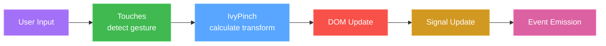

# Quick Reference Guide

Fast lookup reference for ngx-pinch-zoom maintainers. For detailed explanations, see [ARCHITECTURE.md](ARCHITECTURE.md) and [IMPLEMENTATION_GUIDE.md](IMPLEMENTATION_GUIDE.md).

## Table of Contents

- [Key Concepts](#key-concepts)
- [Code Locations](#code-locations)
- [Common Patterns](#common-patterns)
- [Signal Architecture](#signal-architecture)
- [Debugging Checklist](#debugging-checklist)
- [Performance Tips](#performance-tips)
- [Common Gotchas](#common-gotchas)
- [Testing Scenarios](#testing-scenarios)

## Key Concepts

### The Three Core Classes

| Class                  | Location                  | Purpose                    | Dependencies   |
| ---------------------- | ------------------------- | -------------------------- | -------------- |
| **PinchZoomComponent** | `pinch-zoom.component.ts` | Angular component wrapper  | Angular Core   |
| **IvyPinch**           | `ivypinch.ts`             | Core zoom/pan logic        | None (pure TS) |
| **Touches**            | `touches.ts`              | Event detection & handling | None (pure TS) |

### Data Flow



### Transform Mathematics

```typescript
// The core formula applied to elements:
transform: translate3d(${moveX}px, ${moveY}px, 0) scale(${scale})
```

## Code Locations

### Where to Find Things

| What                  | File                      | Line Range | Purpose                 |
| --------------------- | ------------------------- | ---------- | ----------------------- |
| Input signals         | `pinch-zoom.component.ts` | ~47-70     | Component configuration |
| Computed signals      | `pinch-zoom.component.ts` | ~78-120    | Derived state           |
| Pinch handling        | `ivypinch.ts`             | ~300-400   | Pinch zoom logic        |
| Pan handling          | `ivypinch.ts`             | ~400-500   | Pan/drag logic          |
| Touch detection       | `touches.ts`              | ~150-250   | Gesture recognition     |
| Transform application | `ivypinch.ts`             | ~600-700   | DOM manipulation        |
| Default properties    | `properties.ts`           | All        | Configuration defaults  |
| Type definitions      | `interfaces.ts`           | All        | TypeScript interfaces   |

### Key Methods by Task

| Task                  | Method                | File                      | What It Does                              |
| --------------------- | --------------------- | ------------------------- | ----------------------------------------- |
| **User zooms in**     | `handlePinch()`       | `ivypinch.ts`             | Calculates new scale from finger distance |
| **User pans**         | `handleLinearSwipe()` | `ivypinch.ts`             | Calculates new position                   |
| **Apply changes**     | `transformElement()`  | `ivypinch.ts`             | Updates CSS transform                     |
| **Detect pinch**      | `detectPinch()`       | `touches.ts`              | Recognizes 2-finger gesture               |
| **Detect pan**        | `detectLinearSwipe()` | `touches.ts`              | Recognizes 1-finger drag                  |
| **Detect double-tap** | `detectDoubleTap()`   | `touches.ts`              | Recognizes rapid taps                     |
| **Brightness up**     | `brightnessIn()`      | `pinch-zoom.component.ts` | Increases brightness by step              |
| **Brightness down**   | `brightnessOut()`     | `pinch-zoom.component.ts` | Decreases brightness by step              |
| **Reset brightness**  | `resetBrightness()`   | `pinch-zoom.component.ts` | Resets brightness to 1.0                  |

## Common Patterns

### Adding a New Input Property

```typescript
// 1. Add to component inputs (pinch-zoom.component.ts)
myNewOption = input<boolean>(false);

// 2. Add to mergedProperties computed signal
mergedProperties = computed<ComponentProperties>(() => {
    return {
        ...this.defaultComponentProperties,
        myNewOption: this.myNewOption(),
        // ... other properties
    };
});

// 3. Add to interface (interfaces.ts)
export interface Properties {
    myNewOption?: boolean;
    // ... other properties
}

// 4. Add default value (properties.ts)
export const defaultProperties: Properties = {
    myNewOption: false,
    // ... other properties
};
```

### Adding a New Output Event

```typescript
// 1. Create output signal (pinch-zoom.component.ts)
myNewEvent = output<MyEventType>();

// 2. Emit when appropriate
this.myNewEvent.emit(eventData);
```

### Adding CSS Filter Effects (Brightness Example)

```typescript
// 1. Add input signals for configuration (pinch-zoom.component.ts)
enableBrightnessControl = input<boolean>(false);
brightnessStep = input<number>(0.1);

// 2. Add internal signal for state
private currentBrightness = signal<number>(1.0);

// 3. Add computed signal for public access
brightness = computed<number>(() => {
    return this.currentBrightness();
});

// 4. Add control methods
brightnessIn(): number {
    const newBrightness = Math.min(
        this.brightness() + this.brightnessStep(),
        this.maxBrightness()
    );
    this.currentBrightness.set(newBrightness);
    this.brightnessChanged.emit(newBrightness);
    return newBrightness;
}

// 5. Add effect to apply CSS filter (constructor)
effect(() => {
    const brightness = this.brightness();
    const element = this.elementRef.nativeElement.querySelector('.pinch-zoom-content');
    if (element) {
        element.style.filter = `brightness(${brightness})`;
    }
});

// 6. Add UI controls in template
<!-- In pinch-zoom.component.html -->
@if (isBrightnessControl()) {
  <div class="pz-brightness-controls">
    <button (click)="brightnessIn()">Brighter</button>
    <button (click)="brightnessOut()">Darker</button>
  </div>
}
```

### Adding New Gesture Logic

```typescript
// 1. Add event type (touches.ts)
export type TouchEvent = 'pinch' | 'pan' | 'my-new-gesture';

// 2. Add detection method (touches.ts)
private detectMyNewGesture(): boolean {
    // Detection logic
    this.eventType = 'my-new-gesture';
    return true;
}

// 3. Call from detectGesture() (touches.ts)
detectGesture() {
    this.detectMyNewGesture() ||
    this.detectPinch() ||
    this.detectLinearSwipe() ||
    this.detectDoubleTap();
}

// 4. Add handler (ivypinch.ts)
private handleMyNewGesture = (event: any) => {
    // Handle gesture
};

// 5. Register handler (ivypinch.ts, in constructor)
this.touches.on('my-new-gesture', this.handleMyNewGesture as any);
```

## Signal Architecture

### Input Signals (Configuration from User)

```typescript
// Zoom controls
transitionDuration = input<number>(200); // Animation speed
doubleTap = input<boolean>(true); // Enable double-tap
limitZoom = input<number>(3); // Max zoom level
disabled = input<boolean>(false); // Disable all

// Brightness controls
enableBrightnessControl = input<boolean>(false); // Enable brightness UI
brightnessStep = input<number>(0.1); // Brightness step size
minBrightness = input<number>(0.1); // Min brightness
maxBrightness = input<number>(2.0); // Max brightness
```

### Internal Signals (Component State)

```typescript
private currentScale = signal<number>(1);          // Current zoom
private currentBrightness = signal<number>(1.0);   // Current brightness
private isZooming = signal<boolean>(false);        // Is user zooming
private isPanning = signal<boolean>(false);        // Is user panning
```

### Computed Signals (Derived State)

```typescript
// Zoom-related
isZoomedIn = computed(() => this.scale() > 1);
maxScale = computed(() => this.calculateMaxScale());
isControl = computed(() => this.shouldShowControls());

// Brightness-related
brightness = computed(() => this.currentBrightness());
isBrightnessControl = computed(() => this.enableBrightnessControl());
isBrightnessAtMin = computed(() => this.brightness() <= this.minBrightness());
isBrightnessAtMax = computed(() => this.brightness() >= this.maxBrightness());
```

### Output Signals (Events to User)

```typescript
zoomChanged = output<number>(); // Emits when scale changes
brightnessChanged = output<number>(); // Emits when brightness changes
```

### Signal Effects (Side Effects)

```typescript
constructor() {
    effect(() => {
        // React to signal changes
        if (this.disabled()) {
            this.pinchZoom?.destroy();
        }
    });
}
```

## Debugging Checklist

### Image Not Zooming

1. ✅ Check `disabled` input is `false`
2. ✅ Verify element has content (image loaded)
3. ✅ Check browser console for errors
4. ✅ Verify `limitZoom` is not set to `1`
5. ✅ Test with both touch and mouse wheel
6. ✅ Check if `disableZoomControl` is blocking input

### Panning Not Working

1. ✅ Verify image is zoomed in (`scale > 1`)
2. ✅ Check `disablePan` is `false`
3. ✅ Verify `scale >= minPanScale` (default 1.0001)
4. ✅ Test that touch/mouse events are firing
5. ✅ Check if `limitPan` is preventing movement

### Transforms Not Applying

1. ✅ Inspect element CSS in DevTools
2. ✅ Verify `transformElement()` is being called
3. ✅ Check transform string format
4. ✅ Look for conflicting CSS rules
5. ✅ Verify element reference is valid

### Performance Issues

1. ✅ Check for excessive logging
2. ✅ Verify not triggering change detection loops
3. ✅ Look for memory leaks (destroy() called?)
4. ✅ Check image size (too large?)
5. ✅ Verify using `transform` (not `left/top`)

### Event Handler Issues

1. ✅ Verify listeners are registered in constructor
2. ✅ Check event types match ('pinch', 'pan', etc.)
3. ✅ Ensure handlers use arrow functions or `.bind(this)`
4. ✅ Verify destroy() removes listeners
5. ✅ Check `as any` type assertions are correct

## Performance Tips

### DO Use

✅ **CSS Transform** - Hardware accelerated

```typescript
element.style.transform = `translate3d(${x}px, ${y}px, 0) scale(${scale})`;
```

✅ **Signals for State** - Fine-grained reactivity

```typescript
private currentScale = signal<number>(1);
```

✅ **Computed for Derived Values** - Automatic memoization

```typescript
isZoomedIn = computed(() => this.scale() > 1);
```

✅ **translate3d** - Triggers GPU acceleration

```typescript
translate3d(${moveX}px, ${moveY}px, 0)  // Force 3D rendering
```

### DON'T Use

❌ **Position Properties** - Triggers reflow

```typescript
element.style.left = `${x}px`; // Bad!
element.style.top = `${y}px`; // Bad!
```

❌ **Excessive Logging** - Performance cost

```typescript
console.log(this.scale); // Remove in production
```

❌ **Change Detection Triggers** - Causes re-renders

```typescript
// Avoid calling this repeatedly
this.cdr.markForCheck();
```

## Common Gotchas

### 1. Touch Events Don't Bubble Correctly

**Problem**: Parent elements don't receive touch events.

**Solution**: Event listeners are on the container element directly.

```typescript
// In IvyPinch constructor
this.element.addEventListener('touchstart', handler);
```

### 2. Pinch Scale Jumps on First Touch

**Problem**: Initial `distance` is 0, causing division issues.

**Solution**: Initialize distance in `handlePinch`:

```typescript
if (this.distance === 0) {
    this.distance = touches.distance;
}
```

### 3. Pan Continues After Lifting Finger

**Problem**: No touchend handler to stop panning.

**Solution**: Touches class handles this:

```typescript
handleTouchEnd() {
    this.eventType = undefined;  // Clears gesture
}
```

### 4. Zoom Buttons Don't Show/Hide

**Problem**: `isControl` computed signal not updating.

**Solution**: Check dependencies in computed:

```typescript
isControl = computed(() => {
    const control = this.disableZoomControl();
    const zoomed = this.isZoomedIn();
    // ... logic depends on these signals
});
```

### 5. Memory Leaks on Component Destroy

**Problem**: Event listeners not removed.

**Solution**: Call `destroy()` in `ngOnDestroy`:

```typescript
ngOnDestroy(): void {
    this.pinchZoom?.destroy();
}
```

### 6. Double-Tap Fires Twice

**Problem**: Both touchend and click fire.

**Solution**: Touches class uses timeout to distinguish:

```typescript
private doubleTapTimeout: number = 0;

detectDoubleTap(): boolean {
    clearTimeout(this.doubleTapTimeout);
    // ... timing logic
}
```

## Gesture State Machine

### Touch Event Flow

```mermaid
flowchart TD
    A[User touches screen]:::userAction --> B[touchstart event]:::browserEvent
    B --> C[Touches.handleTouchStart]:::touchHandler
    C --> D[Store initial position]:::stateUpdate
    D --> E[User moves fingers]:::userAction
    E --> F[touchmove event]:::browserEvent
    F --> G[Touches.handleTouchMove]:::touchHandler
    G --> H[Touches.detectGesture]:::detection
    H --> I{Determines gesture type}:::decision
    I -->|pinch| J[Sets eventType = 'pinch']:::stateUpdate
    I -->|pan| K[Sets eventType = 'pan']:::stateUpdate
    I -->|doubletap| L[Sets eventType = 'tap']:::stateUpdate
    J --> M[Emits event via handler]:::emission
    K --> M
    L --> M
    M --> N[IvyPinch.handlePinch/handlePan]:::logicHandler
    N --> O[Calculate new scale/position]:::calculation
    O --> P[Apply constraints]:::calculation
    P --> Q[IvyPinch.transformElement]:::domUpdate
    Q --> R[Update element.style.transform]:::domUpdate
    R --> S[Call zoomChanged callback]:::callback
    S --> T[Component updates signals]:::signalUpdate
    T --> U[User lifts fingers]:::userAction
    U --> V[touchend event]:::browserEvent
    V --> W[Touches.handleTouchEnd]:::touchHandler
    W --> X[Reset eventType]:::stateUpdate
    X --> Y[Done]:::end

    classDef userAction fill:#a371f7,stroke:#d29eff,color:#fff
    classDef browserEvent fill:#db61a2,stroke:#f778ba,color:#fff
    classDef touchHandler fill:#3fb950,stroke:#56d364,color:#fff
    classDef stateUpdate fill:#d29922,stroke:#e3b341,color:#fff
    classDef detection fill:#58a6ff,stroke:#79c0ff,color:#fff
    classDef decision fill:#f85149,stroke:#ff7b72,color:#fff
    classDef emission fill:#bc8cff,stroke:#d2a8ff,color:#fff
    classDef logicHandler fill:#58a6ff,stroke:#79c0ff,color:#fff
    classDef calculation fill:#58a6ff,stroke:#79c0ff,color:#fff
    classDef domUpdate fill:#f85149,stroke:#ff7b72,color:#fff
    classDef callback fill:#d29922,stroke:#e3b341,color:#fff
    classDef signalUpdate fill:#d29922,stroke:#e3b341,color:#fff
    classDef end fill:#3fb950,stroke:#56d364,color:#fff
```

## Testing Scenarios

### Manual Testing Checklist

#### Basic Functionality

- [ ] Pinch zoom in with 2 fingers
- [ ] Pinch zoom out with 2 fingers
- [ ] Pan image when zoomed in
- [ ] Double-tap to zoom in
- [ ] Double-tap again to zoom out
- [ ] Mouse wheel to zoom
- [ ] Zoom buttons (if enabled)
- [ ] Brightness controls (if enabled)
- [ ] Increase brightness button
- [ ] Decrease brightness button

#### Edge Cases

- [ ] Zoom in beyond max limit
- [ ] Zoom out beyond min limit
- [ ] Pan beyond image edges (with limitPan)
- [ ] Rapid zoom in/out
- [ ] Change orientation while zoomed
- [ ] Multiple rapid double-taps
- [ ] Brightness at minimum (controls disabled)
- [ ] Brightness at maximum (controls disabled)
- [ ] Rapid brightness adjustments

#### Configuration Tests

- [ ] Set `disabled=true` → all gestures disabled
- [ ] Set `disablePan=true` → cannot pan
- [ ] Set `doubleTap=false` → no double-tap
- [ ] Set `limitZoom=2` → stops at 2x
- [ ] Set `autoZoomOut=true` → resets after pinch
- [ ] Set `wheel=false` → mouse wheel disabled
- [ ] Set `enableBrightnessControl=true` → shows brightness controls
- [ ] Set `brightnessStep=0.2` → larger brightness steps
- [ ] Set `minBrightness=0.5` → stops at 0.5 minimum
- [ ] Set `maxBrightness=1.5` → stops at 1.5 maximum

#### Performance Tests

- [ ] Large image (>5MB) zooms smoothly
- [ ] Rapid gestures don't lag
- [ ] No memory leaks after destroy
- [ ] Smooth animations at 60fps

## Quick Command Reference

```bash
# Build library
npm run build

# Watch mode
npm run watch

# Format code
npm run format

# Check formatting
npm run format:check
```

## File Size Reference

| File                      | Lines | Complexity |
| ------------------------- | ----- | ---------- |
| `pinch-zoom.component.ts` | ~200  | Medium     |
| `ivypinch.ts`             | ~800  | High       |
| `touches.ts`              | ~500  | High       |
| `interfaces.ts`           | ~30   | Low        |
| `properties.ts`           | ~40   | Low        |

## Version Compatibility

| Library Version | Angular Version | TypeScript Version |
| --------------- | --------------- | ------------------ |
| 20.0.0          | 20.0.0+         | 5.8.0+             |

---

**Tip**: Use your editor's "Go to Definition" (F12) to jump from references to implementations quickly!
