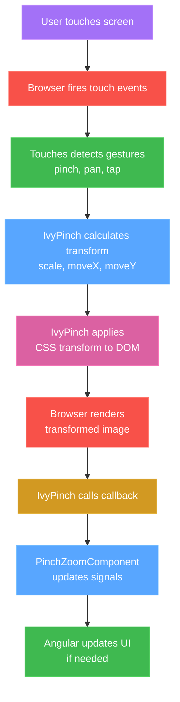
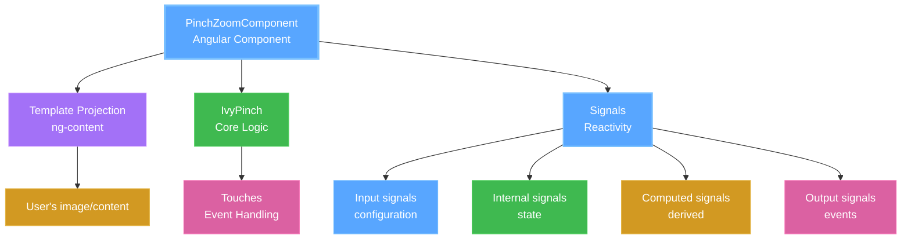
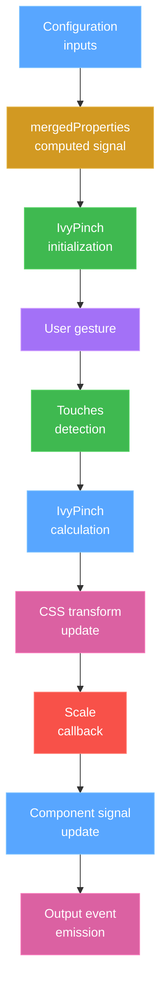

# Documentation for Maintainers

Welcome! This documentation will help you understand and maintain the ngx-pinch-zoom library.

## 📚 Documentation Overview

### For New Maintainers - Start Here

1. **[QUICK_REFERENCE.md](QUICK_REFERENCE.md)** ⚡
   - Fast lookup for common tasks
   - Code locations
   - Common patterns
   - Debugging checklist
   - **Read this first for quick answers!**

2. **[ARCHITECTURE.md](ARCHITECTURE.md)** 🏗️
   - Deep dive into how everything works
   - Component interaction diagrams
   - Transform mathematics explained
   - Event flow documentation
   - **Read this to understand the system**

3. **[IMPLEMENTATION_GUIDE.md](IMPLEMENTATION_GUIDE.md)** 🛠️
   - Step-by-step implementation examples
   - How to add features
   - How to fix bugs
   - Code customizations
   - **Read this when making changes**

### Documentation Organization

```
docs/
├── README.md                    ← You are here
├── QUICK_REFERENCE.md          ← Fast lookup guide
├── ARCHITECTURE.md             ← How it works (detailed)
└── IMPLEMENTATION_GUIDE.md     ← How to change it (examples)
```

## 🎯 Learning Path

### If you're brand new:

1. **5 minutes**: Skim [QUICK_REFERENCE.md](QUICK_REFERENCE.md) - "Key Concepts" section
2. **20 minutes**: Read [ARCHITECTURE.md](ARCHITECTURE.md) - "Overview" and "Component Architecture"
3. **15 minutes**: Browse the source code in `projects/ngx-pinch-zoom/src/lib/`
4. **As needed**: Reference [IMPLEMENTATION_GUIDE.md](IMPLEMENTATION_GUIDE.md) when implementing

### If you need to fix a bug:

1. Check [QUICK_REFERENCE.md](QUICK_REFERENCE.md) - "Debugging Checklist"
2. Look up the bug type in [IMPLEMENTATION_GUIDE.md](IMPLEMENTATION_GUIDE.md) - "Fixing Bugs"
3. Reference [ARCHITECTURE.md](ARCHITECTURE.md) for the affected system

### If you need to add a feature:

1. Read [IMPLEMENTATION_GUIDE.md](IMPLEMENTATION_GUIDE.md) - "Adding New Features"
2. Reference [ARCHITECTURE.md](ARCHITECTURE.md) - "Component Architecture"
3. Check [QUICK_REFERENCE.md](QUICK_REFERENCE.md) - "Code Locations"

## 🔍 Quick Answers

### "Where do I find...?"

| Question | Answer |
|----------|--------|
| How pinch zoom works? | ARCHITECTURE.md → "Transform Mathematics" |
| How to add an input property? | IMPLEMENTATION_GUIDE.md → "Adding New Features" |
| Why isn't pan working? | QUICK_REFERENCE.md → "Debugging Checklist" |
| What is `transformElement()`? | ARCHITECTURE.md → "Transform Mathematics" |
| How to add rotation? | IMPLEMENTATION_GUIDE.md → "Feature: Add Rotation Support" |
| Performance best practices? | QUICK_REFERENCE.md → "Performance Tips" |
| Event flow diagram? | ARCHITECTURE.md → "Event System" |

### "How do I...?"

| Task | Document |
|------|----------|
| Fix image jumping | IMPLEMENTATION_GUIDE.md → "Bug: Image Jumps on First Touch" |
| Add custom zoom behavior | IMPLEMENTATION_GUIDE.md → "Custom: Programmatic Zoom to Specific Point" |
| Debug transforms | IMPLEMENTATION_GUIDE.md → "Technique 1: Visual Transform Debugging" |
| Improve performance | IMPLEMENTATION_GUIDE.md → "Performance Optimization" |
| Add zoom indicator | IMPLEMENTATION_GUIDE.md → "Custom: Zoom Level Indicator" |

## 📖 Reading Code

### Source Files (In Order of Complexity)

1. **properties.ts** (Easiest)
   - Just default configuration values
   - Good starting point

2. **interfaces.ts** (Easy)
   - TypeScript type definitions
   - Understand data structures

3. **pinch-zoom.component.ts** (Medium)
   - Angular component with signals
   - See how properties flow

4. **touches.ts** (Medium-Hard)
   - Event detection logic
   - Gesture recognition

5. **ivypinch.ts** (Hardest)
   - Core zoom/pan mathematics
   - Transform calculations
   - **Most complex file in the library**

### Recommended Reading Order

```
1. Read QUICK_REFERENCE.md (Overview)
   ↓
2. Skim ARCHITECTURE.md (Understanding)
   ↓
3. Read properties.ts (See defaults)
   ↓
4. Read interfaces.ts (See data types)
   ↓
5. Browse pinch-zoom.component.ts (See signals)
   ↓
6. Read ivypinch.ts (See core logic)
   ↓
7. Reference IMPLEMENTATION_GUIDE.md (When needed)
```

## 🎓 Understanding the System

### The Big Picture



### Key Concepts to Understand

1. **CSS Transform Matrix**
   - How we apply zoom and pan using a single CSS property
   - See: ARCHITECTURE.md → "Transform Mathematics"

2. **Signal-Based Reactivity**
   - How Angular signals provide fine-grained updates
   - See: ARCHITECTURE.md → "Signal Architecture"

3. **Gesture State Machine**
   - How events transition between states
   - See: QUICK_REFERENCE.md → "Gesture State Machine"

4. **Coordinate Systems**
   - Element-relative vs page-relative positions
   - See: ARCHITECTURE.md → "Transform Mathematics"

## 🛠️ Making Changes

### Before You Code

1. ✅ Read relevant documentation section
2. ✅ Understand the affected code path
3. ✅ Consider edge cases
4. ✅ Plan your implementation
5. ✅ Write the code
6. ✅ Test thoroughly
7. ✅ Update documentation if needed

### Code Quality Standards

- ✅ Add comments for complex logic
- ✅ Use descriptive variable names
- ✅ Keep functions small and focused
- ✅ Follow existing patterns
- ✅ Write type-safe TypeScript
- ✅ Test on both touch and mouse
- ✅ Check performance impact

## 🐛 Debugging

### Enable Verbose Logging

Add to IvyPinch methods:

```typescript
console.log('[IvyPinch] handlePinch', {
    scale: this.scale,
    distance: this.distance,
    moveX: this.moveX,
    moveY: this.moveY
});
```

### Common Issues & Solutions

Check: QUICK_REFERENCE.md → "Common Gotchas"

## 📊 Architecture Diagrams

### Component Hierarchy



### Data Flow



## 📝 Documentation Maintenance

### When to Update Docs

- ✅ Adding a new feature
- ✅ Changing public API
- ✅ Fixing a significant bug
- ✅ Discovering a gotcha
- ✅ Improving performance
- ✅ Refactoring architecture

### What to Update

- **ARCHITECTURE.md** - When changing how things work internally
- **IMPLEMENTATION_GUIDE.md** - When adding common patterns
- **QUICK_REFERENCE.md** - When adding quick lookup info
- **CHANGELOG.md** - For every change (in root)
- **README.md** - For user-facing changes (in root)

## 🎯 Next Steps

### If you're just getting started:

1. Read [QUICK_REFERENCE.md](QUICK_REFERENCE.md) completely
2. Skim [ARCHITECTURE.md](ARCHITECTURE.md)
3. Run `npm run build` to see it compile
4. Make a small test change
5. Read [IMPLEMENTATION_GUIDE.md](IMPLEMENTATION_GUIDE.md) as needed

### If you're fixing a bug:

1. Reproduce the bug
2. Check [QUICK_REFERENCE.md](QUICK_REFERENCE.md) → "Debugging Checklist"
3. Add logging to understand what's happening
4. Reference [IMPLEMENTATION_GUIDE.md](IMPLEMENTATION_GUIDE.md) → "Fixing Bugs"
5. Implement fix
6. Test thoroughly
7. Update docs if needed

### If you're adding a feature:

1. Read [IMPLEMENTATION_GUIDE.md](IMPLEMENTATION_GUIDE.md) → "Adding New Features"
2. Follow the step-by-step guide
3. Reference [ARCHITECTURE.md](ARCHITECTURE.md) for context
4. Write and test implementation
5. Update documentation
6. Update CHANGELOG.md

## 🆘 Getting Help

### Documentation Not Clear?

1. Check if answer is in another doc file
2. Look at source code comments
3. Create an issue on GitHub
4. Consider improving the docs for others

### Still Stuck?

- Review the original library: https://github.com/drozhzhin-n-e/ngx-pinch-zoom
- Check Angular docs: https://angular.dev
- Search GitHub issues
- Ask in Angular community forums

## 🎉 Contributing Back

If you improve the documentation or code:

1. Test your changes
2. Update relevant documentation
3. Follow commit message format
4. Create a pull request
5. Help others by sharing knowledge!

---

**Happy coding!** These docs are living documents - improve them as you learn! 🚀
